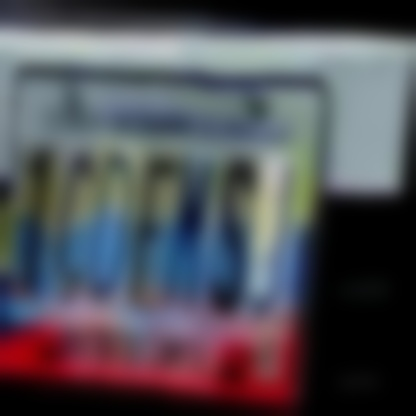
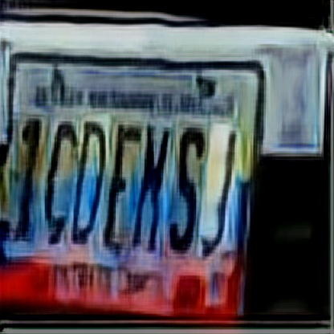
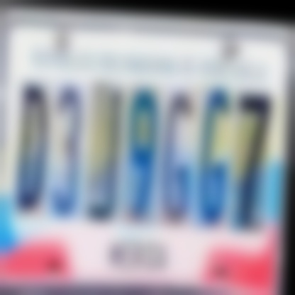
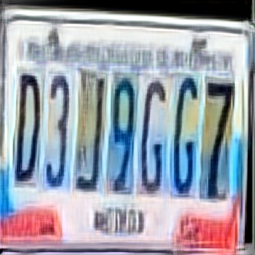
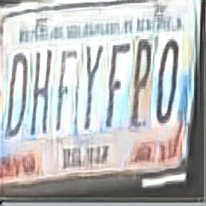

# Image deblurring and Object detection

**Dataset preparation**


**Installation**

```pip install -r requirements.txt```

**Train**

```python train.py```

**Test**

pretrained weights can be [found here](https://drive.google.com/file/d/1M0zk2udF6GfGgMI84xCcGrUmnyZGsg1T/view?usp=sharing)

```python predict.py -i ./test_img -o ./submit -m ./saved_models/best_fpn.h5``` 

**Gallery**

<p float="left">


</p>

<p float="left">


</p>

<p float="left">


</p>

**Colab Notebook**

[Notebook](https://colab.research.google.com/drive/1yHv9dZt_GYQW69RSbShhwR1TChauF9BL?usp=sharing)

**Credits**

- [DeblurGANv2](https://github.com/VITA-Group/DeblurGANv2)
